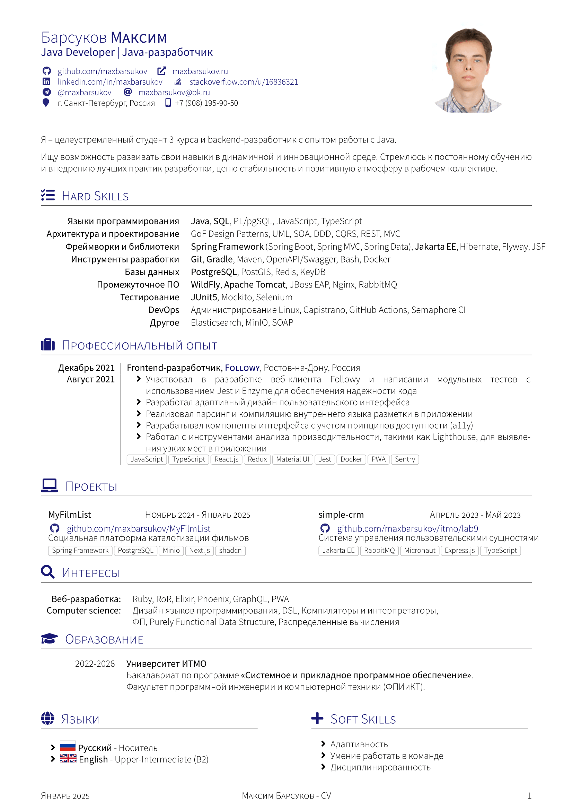

# cv

| en :gb: | ru :ru: |
| ---- | ---- |
| README.md | [README.ru.md](README.ru.md) |

> This is my resume (and CV) in LaTeX.

## Table of contents
1. [Updates](#updates)
2. [Getting Started](#getting-started)
   1. [Pre-reqs](#pre-reqs)
   2. [Building and Running](#run)
3. [Preview](#preview)
4. [Contributing](#contributing)
5. [Code of Conduct](#code-of-conduct)
6. [License](#license)

## Updates 

  
<b>🔔 Oct. 12, 2024 (v0.1.2)</b>

> - Add resume for Java.

## Getting Started 

### Pre-reqs 

Make sure you have [`git`](https://git-scm.com/) installed.

To build and run this app locally you will need a few things:

- Check you have [Make](https://en.wikipedia.org/wiki/Make_(software)) installed;
- You need to have [latexmk](https://ctan.org/pkg/latexmk) installed and some other packages. On Ubuntu you can install all needed packages with:

            sudo apt-get -qq update
            
            sudo apt-get install -y --no-install-recommends latexmk texlive-fonts-extra texlive-fonts-recommended texlive-latex-base texlive-latex-extra texlive-latex-recommended texlive-luatex texlive-xetex texlive-pictures texlive-lang-cyrillic texlive-bibtex-extra biber lmodern fonts-font-awesome

Clone this repository:

    git clone git@github.com:maxbarsukov/cv.git

### Building and Running 

Builds `cv.pdf` to `out/`:

    make

Cleans the temporary files generated by the tex programs in use:

    make clean

Displays the compiled document in a common PDF viewer:

    make display

## Preview 

| Page. 1 |
|:---:|
|  |

## Contributing 

Bug reports and pull requests are welcome on GitHub at https://github.com/maxbarsukov/cv.
This project is intended to be a safe, welcoming space for collaboration, and contributors are expected to adhere to the [code of conduct](https://github.com/maxbarsukov/cv/blob/master/CODE_OF_CONDUCT.md).

## Code of Conduct 

Everyone interacting in the **cv** project's codebases, issue trackers, chat rooms and mailing lists is expected to follow the [code of conduct](https://github.com/maxbarsukov/cv/blob/master/CODE_OF_CONDUCT.md).

## License 

The project is available as open source under the terms of the [LPPL-1.3c License](https://opensource.org/license/lppl). \
*Copyright 2024 Max Barsukov*

**Leave a star :star: if you find this project useful.**
