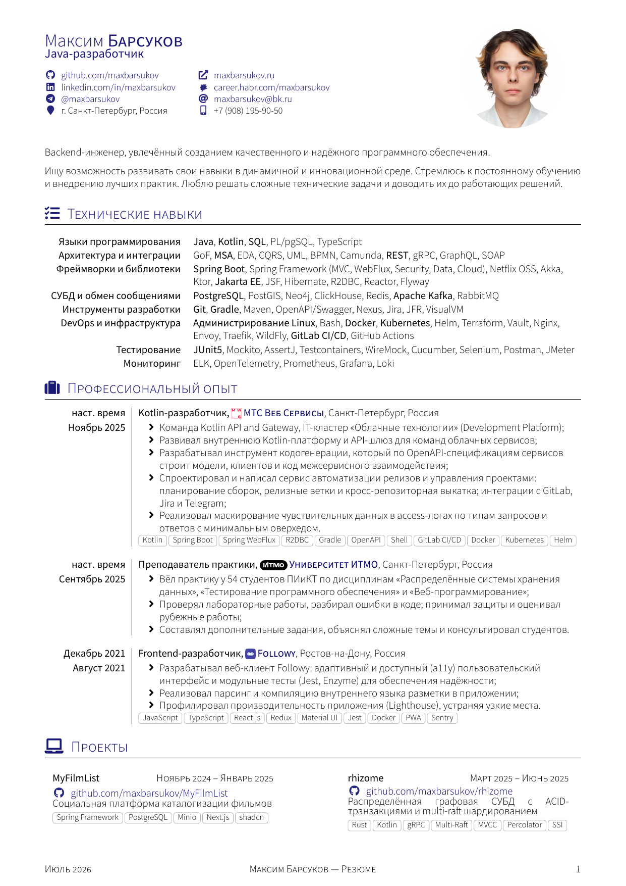
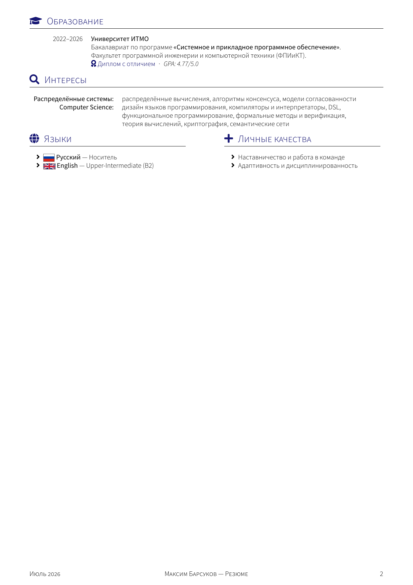

# cv

| en :gb: | ru :ru: |
| ---- | ---- |
| [README.md](./README.md) | README.ru.md |

> Очередное резюме, созданное с помощью LaTeX.

## Оглавление
1. [Обновления](#updates)
2. [Начало работы](#getting-started)
   1. [Предварительные требования](#pre-reqs)
   2. [Сборка и запуск](#run)
3. [Предварительный просмотр](#preview)
4. [Содействие](#contributing)
5. [Нормы поведения](#code-of-conduct)
6. [Лицензия](#license)

## Обновления 

  
<b>🔔 25 июля 2026 (v0.2.0)</b>

> - Наполнены опыт работы (MWS, ИТМО) и проекты.
> - Переписан summary, переработаны технические навыки.
> - Новое фото, ссылка на Хабр Карьеру, метаданные PDF и правки вёрстки.

  
<b>🔔 4 декабря 2024 (v0.1.3)</b>

> - Добавлено резюме для `Ruby`.

  
<b>🔔 12 октября 2024 (v0.1.2)</b>

> - Добавлено резюме для `Java`.

## Начало работы 

### Предварительные требования 

Убедитесь, что у вас установлен [`git`](https://git-scm.com/book/ru/v2/%D0%92%D0%B2%D0%B5%D0%B4%D0%B5%D0%BD%D0%B8%D0%B5-%D0%A3%D1%81%D1%82%D0%B0%D0%BD%D0%BE%D0%B2%D0%BA%D0%B0-Git) installed.

Чтобы собрать и запустить это приложение локально, вам понадобится несколько вещей:

- Убедитесь, что у вас есть [Make](https://ru.wikipedia.org/wiki/Make);
- У вас должен быть установлен [latexmk](https://ctan.org/pkg/latexmk) и некоторые другие пакеты. В Ubuntu вы можете установить их все с помощью:

            sudo apt-get -qq update
            
            sudo apt-get install -y --no-install-recommends latexmk texlive-fonts-extra texlive-fonts-recommended texlive-latex-base texlive-latex-extra texlive-latex-recommended texlive-luatex texlive-xetex texlive-pictures texlive-lang-cyrillic texlive-bibtex-extra biber lmodern fonts-font-awesome

Склонируйте этот репозиторий:

    git clone git@github.com:maxbarsukov/cv.git

### Сборка и запуск 

Компилирует CV в файл `out/cv-*.pdf`:

    make # собирает все проекты
    make PROJECTS=cv-ruby # собирает только указанный проект

Очищает временные файлы, созданные используемыми программами tex:

    make clean

Отображает скомпилированный документ в обычном средстве просмотра PDF:

    make display

## Предварительный просмотр 

  
<b>Страница 1</b>

  
<b>Страница 2</b>

## Содействие 

Сообщения об ошибках и запросы на вытягивание приветствуются на GitHub по адресу https://github.com/maxbarsukov/cv.
Этот проект задуман как безопасное и гостеприимное пространство для совместной работы, и ожидается, что участники будут придерживаться [кодекса поведения](https://github.com/maxbarsukov/cv/blob/master/CODE_OF_CONDUCT.md).

## Нормы поведения 

Ожидается, что все, кто взаимодействует с кодовыми базами, системами отслеживания проблем, чатами и списками рассылки проекта **cv**, будут следовать [кодексу поведения](https://github.com/maxbarsukov/cv/blob/master/CODE_OF_CONDUCT.md).

## Лицензия 

Проект доступен с открытым исходным кодом на условиях [Лицензии LPPL-1.3c](https://opensource.org/license/lppl). \
*Авторские права 2026 Max Barsukov*

**Поставьте звезду :star:, если вы нашли этот проект полезным.**
